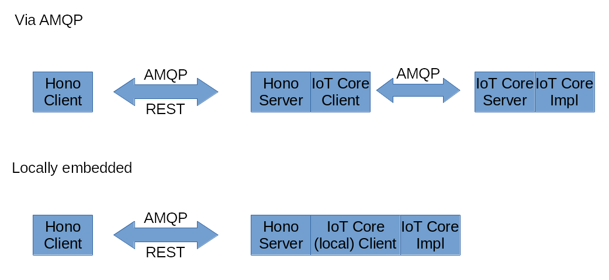

# Hono Device Registry Implementation

This is an implementation of the Eclipse Hono device registry using the
IoT Core Device Registry.

 

## Pre-requisites

Have Minishift installed and running.

## Building

```bash
eval $(minishift docker-env)
mvn clean install
```

## Testing

```bash
ADDR=http://localhost:8080
curl -X POST -i -d 'device_id=4711' $ADDR/registration/DEFAULT_TENANT
curl -X GET -i $ADDR/registration/DEFAULT_TENANT/4711
```